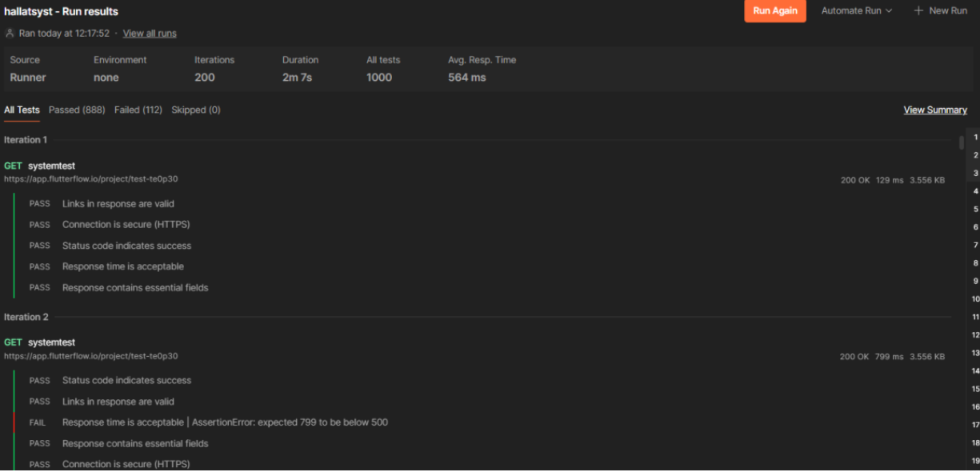
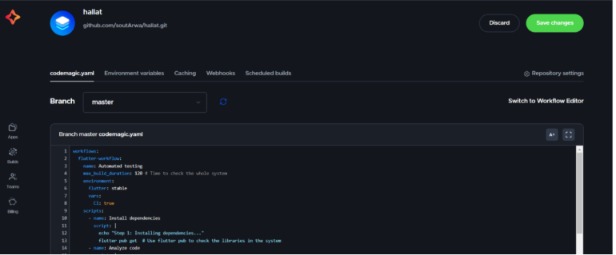
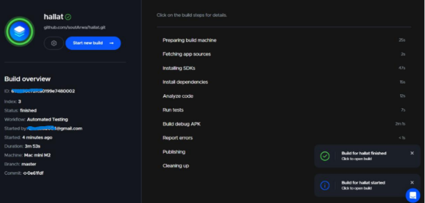

# Hallat – Tourism Application (QA)

  

## Overview

Hallat is a tourism application developed as a team project. My primary role was Quality Assurance (QA), ensuring the application met quality standards through comprehensive testing, API validation, and bug reporting.

> **Note:** This repository showcases my Quality Assurance contributions to the project. The application development was completed by the development team.

---

## My Contributions

- Manual Testing
- Functional Testing
- API Testing using Postman
- Test Case Execution
- Bug Reporting
- Quality Assurance (QA)
- Team Collaboration

---

## Tools

- Postman
- Codemagic
- GitHub

---

## QA Responsibilities

- Executed manual test cases.
- Tested application features and user flows.
- Validated API endpoints using Postman.
- Reported software defects and verified bug fixes.
- Supported the quality assurance process throughout the project lifecycle.

---

## Screenshots

### Welcome Page

### Explore Page

### Explore Page (Alternative)

.png)

### Postman API Testing

### Codemagic

### Codemagic Workflow

---

## Project Goal

To ensure the tourism application delivers a stable, reliable, and high-quality user experience through comprehensive software testing, API validation, and quality assurance practices.
